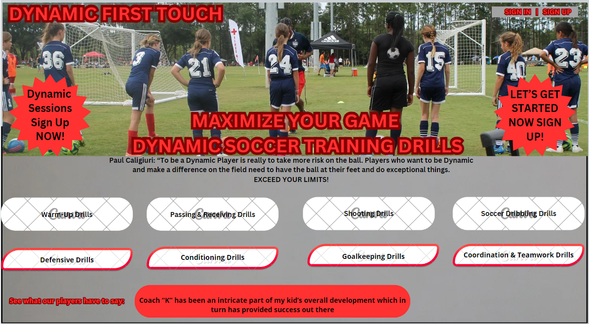
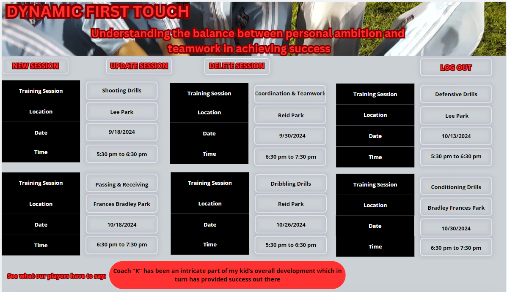
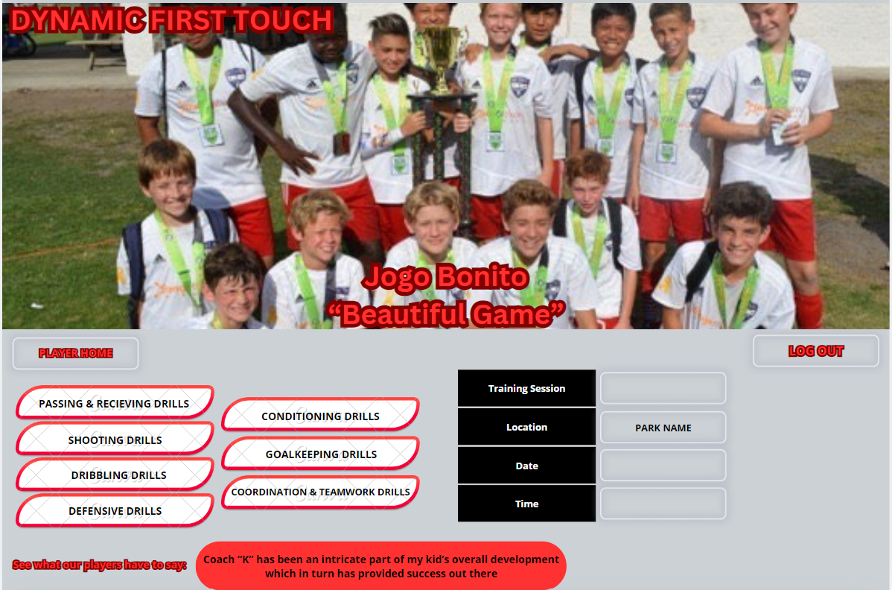

# Dynamic First Touch
https://first-touch-76a0fccb0879.herokuapp.com/

## Players Application that allows them to Create | Update | Delete training sessions and post Reviews.

Dynamic First Touch application allows for Football players (soccer) the ability to create their own account and sign up for training sessions in their account. The app has loaded available sessions that they can sign up for. They will have the ability to delete any training sessions they have entered into their account as well as update.

Naturally, having reviews of the training sessions would be a feather in the cap as long as the coaching maintains the Dynamic in all that they do. Doing so allows for the players to put in a positive review on our sessions and that will help generate more visists and coahing sessions being signed up!

* Create their own Dynamic Training Sessions based on availability
* Update their Dynamic Training Sessions 
* Delete their Dynamic Training Sessions
* Ability for the player to leave a review for others to see how we are doing

### Project Resource Continuity Guide:
https://trello.com/b/GQWCcEBd/first-touch

## Technology
* VS Code
* GitHub
* Heroku
* Trello
* Mongoose
* React
* HTML
* JavaScript
* CSS

### Landing Page:

### Player Session Page:

### Edit or Delete Session Page:

### More Functionality and users to be added
* Ability to actually use CSS to get the images above to reality!
1. AAC, Landing Page give a quick sessions view | Log-In | Sign-Up
2. AAC, View All Coaches and their sessions with details
3. AAC, Book Sessions (Specific Coach)
4. AAC, After booking, you will go to a page that lists out all your bookings
5. AAC, Leave a note in that sessions for the coach.

# Vital Contributions:
## 1. Reed Krosby
## 2. DeShae B
## 3. Miriam Aviles
## 4. Jan Horak

=> Thank you for your patience | Knowldege and PATIENCE!!